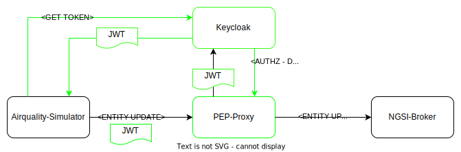

# AirQuality Simulator

Simulator for providing AirQuality Data to FIWARE platforms like [fiware-ops/marinera](https://github.com/FIWARE-Ops/marinera).

## Configuration

Configuration can be done via the [Micronaut](https://micronaut.io/) standard mechanisms, e.g. [application.yaml](./src/main/resources/application.yaml) and environment-variables.
Since list-configuration is better readable in yaml, the application.yaml is the recommended way to do it.

| Property                                | Description                                                           | Env-Var                     |
|-----------------------------------------|-----------------------------------------------------------------------|-----------------------------|
| general.brokerUrl                       | Url of the broker to send the data to                                 | ```http://localhost:1026``` |
| general.historicDensity                 | Minutes between the data points generated for historical data.        | ```15```                    |
| general.fiwareService                   | Fiware-Service for sending the data                                   | ```empty```                 |
| general.fiwareServicePath               | Fiware-ServicePaht for sending the data                               | ```/```                     |
| general.aqSimulations[]                 | List of aq Simulations to be created                                  | ```[]```                    |
| general.aqSimulations[0].id             | Id to be used for the simulation. Will be generated if not provided.  | ```null```                  |
| general.aqSimulations[0].lat            | Latitude of the aquality data.                                        | ```38.07```                 |
| general.aqSimulations[0].longi          | Longitude of aq Simulations to be created                             | ```-1.271```                |
| general.aqSimulations[0].sampleInterval | Sample interval of the datapoints in seconds                          | ```30```                    |
| general.aqSimulations[0].age            | Number of days to generate the historical data for.(e.g. today - age) | ```10```                    |
| keycloak.enabled                        | Should the simulation add auth-tokens from keycloak?                  | ```false```                 |
| keycloak.clientId                       | ClientId to be used at keycloak                                       | ```null```                  |
| keycloak.clientSecret                   | ClientSecret to be used at keycloak                                   | ```null```                  |
| keycloak.username                       | Username to be used at keycloak                                       | ```null```                  |
| keycloak.password                       | Password to be used at keycloak                                       | ```null```                  |
| keycloak.realm                          | Realm to be used at keycloak                                          | ```null```                  |
| keycloak.url                            | URL of keycloak                                                       | ```null```                  |

## Run

Execution can be done via docker: 
```shell
    docker run -v $(pwd)/application.yaml:/etc/sim/application.yaml -e MICRONAUT_CONFIG_FILES=/etc/sim/application.yaml quay.io/fiware/airquality-simulator
```

## Security

The simulator is able to execute its simulation directly against the NGSI Api, but also in a secured way through the [PEP-Proxy](https://github.com/FIWARE/tutorials.PEP-Proxy). 
The simulator currently supports the retrieval of user-tokens from [Keycloak](https://www.keycloak.org/) and transparently adds them to the requests.

The flow looks as following(everything in green is added when ```keycloak.enabled=true```):


Be aware, that ```general.brokerUrl``` needs to be the url of the PEP-Proxy in the secured case. Else, no policy enforcement can happen.